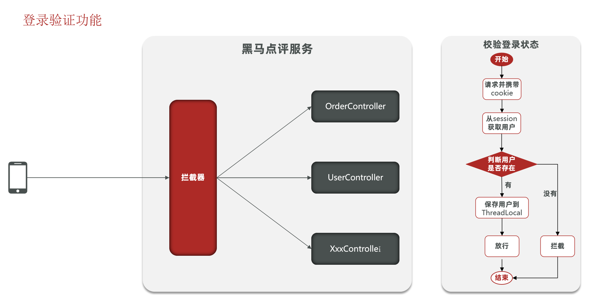
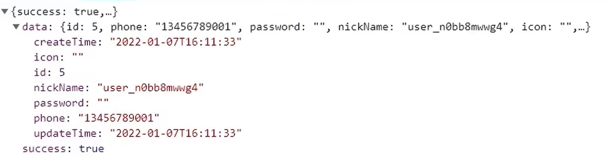
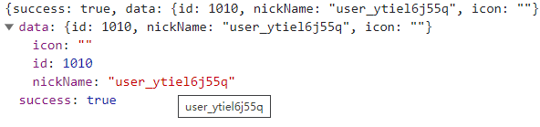
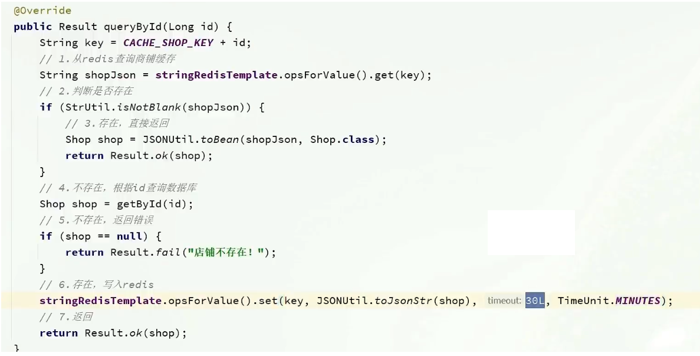
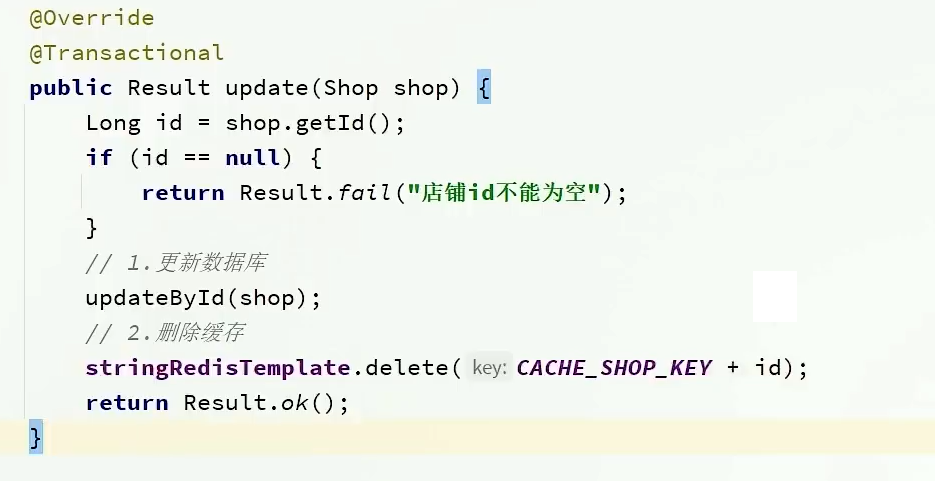

## 短信登录


### **登录状态的校验**

每次http请求访问都应该对登录状态进行校验【即是否是已登录用户】，这里合理的想到用拦截器对每一个controller的访问进行统一拦截。



编写拦截器代码，编写一个类实现HandlerInterceptor

```java
public class LoginInterceptor implements HandlerInterceptor {

    @Override
    public boolean preHandle(HttpServletRequest request, HttpServletResponse response, Object handler) throws Exception {
        //1. 服务器根据http request 获取之前创建的session
        HttpSession session = request.getSession();

        //  2. 获取session中的用户
        Object user = session.getAttribute("user");

        // 3. 判断用户是否存在
        if(user == null){
            response.setStatus(401);
            return false;
        }


        // 4. 存在，保存在ThreadLocal
        // 保存到threadlocal，是为了防止多线程下，每个线程【每个tomcat请求都是独立的线程】拥有一个独立的session实例，防止互相干扰
        UserHolder.saveUser((User)user);

        // 5. 放行
        return true;
    }

    @Override
    public void afterCompletion(HttpServletRequest request, HttpServletResponse response, Object handler, Exception ex) throws Exception {

        UserHolder.removeUser();

    }
}

```

值得注意的是，这里将获取到的登录用户保存到`ThreadLocal`下，考虑到一个web网站，同时会有多个用户进行访问，而对于每个访问，tomcat服务器都会从线程池中找一个线程来完成，所以为了避免当前的用户信息混淆，这里将用户信息保存到ThreadLocal，做到线程隔离。题外话，tomcat的默认最大线程数是150，当然了，可以修改配置，将其调大一点。根据实际的硬件上限等确定


将刚才的拦截器进行统一注册。使其生效

```java
registry.addInterceptor(new LoginInterceptor())
```

具体代码如下

```java
@Configuration
public class MvcConfig implements WebMvcConfigurer {


    @Override
    public void addInterceptors(InterceptorRegistry registry) {
        // 注册 登录拦截器new LoginInterceptor()
        registry.addInterceptor(new LoginInterceptor())
                //排除不需要的拦截器
                .excludePathPatterns(
                        "/shop/**",
                        "/voucher/**",
                        "/shop-type/**",
                        "/upload/**",
                        "/blog/hot",
                        "/user/code",
                        "/user/login"
                ).order(1);
    }
}
```


### **关于当前登录用户信息的的session存储的细粒度的控制**

优化前



优化后



只存储必要的信息，比如id

- 一方面存储少是为了信息的安全考虑，避免将密码等敏感信息泄漏出去

- 另一方面，当前的登陆用户信息都要存储到session和ThreadLocal的tomcat服务器中，存储过多信息，占用内存空间。

因此在登录后的`session.setAttribute("user", user);`时就要修改，后续的存入ThreadLocal自然就是只存必要的属性

更改为

```java
import cn.hutool.core.bean.BeanUtil;

session.setAttribute("user", BeanUtil.copyProperties(user, UserDTO.class));
```

```java
@Data
public class UserDTO {
    private Long id;
    private String nickName;
    private String icon;
}
```

其中`BeanUtil.copyProperties`是hutool的一个工具类，是将类的属性进行有选择性的赋值，将需要的对象属性构成一个新的类，这个工具会自动将类中的属性选择性赋值。ps：盲猜利用反射完成。


登录状态刷新的方案优化


在之前的方案中，他确实可以使用对应路径的拦截，同时刷新登录token令牌的存活时间，但是现在这个拦截器他只是拦截需要被拦截的路径，假设当前用户访问了一些不需要拦截的路径，那么这个拦截器就不会生效，所以此时令牌刷新的动作实际上就不会执行，所以这个方案他是存在问题的

> 比如，登陆后，我一直访问的是首页这种不需要验证登录的请求，这拦截器并不会去拦截。这样登录状态自然也不会刷新。那么在30分钟后，照样会登录失效，即使我是一直访问。


### 优化方案

既然之前的拦截器无法对不需要拦截的路径生效，那么我们可以添加一个拦截器，在第一个拦截器中拦截所有的路径，把第二个拦截器做的事情放入到第一个拦截器中，同时刷新令牌，因为第一个拦截器有了threadLocal的数据，所以此时第二个拦截器只需要判断拦截器中的user对象是否存在即可，完成整体刷新功能。

> 设置两个拦截器，第一个拦截器是拦截所有的请求，无论如何都放行，但是如果token有效的话，会刷新状态。第二个拦截器是只拦截需要登陆的路径，查看本地ThreadLoacl的用户，是否放行


### 缓存最后的优化方案

查询缓存：思路，如果缓存有，则直接返回，如果缓存不存在，则查询数据库，然后存入redis。



更新缓存：

- 对于业务场景低一致性要求的，使用内存淘汰机制

- 对于业务场景高一致性要求的，主动更新，并加上缓存的超时方案，

  - 主动更新，最终采用先修改数据库，再删除缓存，并且保证事务一致性。

    